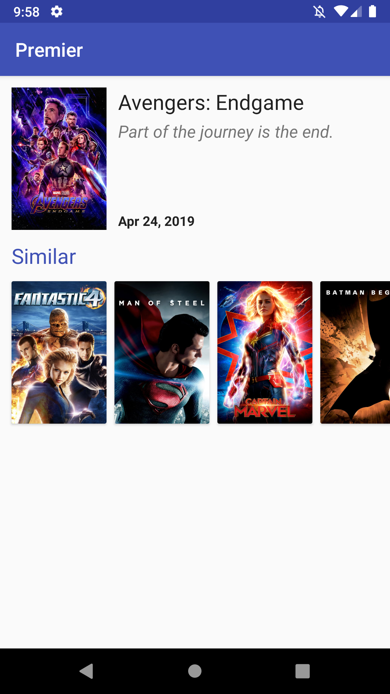

# Android Code Test

Completing this exercise will help us to understand your Android skills before the onsite interview. It's designed to replicate everyday work, but set within an example movie app. You'll complete two tasks: review some code changes, then add a small feature to the app. Both tasks combined should take 2 hours.

To get started, clone this repo and take a look around. The project should build successfully in Android Studio and the unit tests should be green.

## Feature Development
*1 hour 30 mins*

Add the following feature to the app and open your own PR. (Create a new `feature_carousel` branch from master, rather than building on top of the search code!) Focus on adding the new feature over improving existing code.

Extend the movie details screen (`DetailActivity`) to display a carousel of similar movies. Don't worry about matching the design exactly. You'll need to refer to the API documentation for [Get Similar Movies](https://developers.themoviedb.org/3/movies/get-similar-movies). Using third-party libraries is okay.

